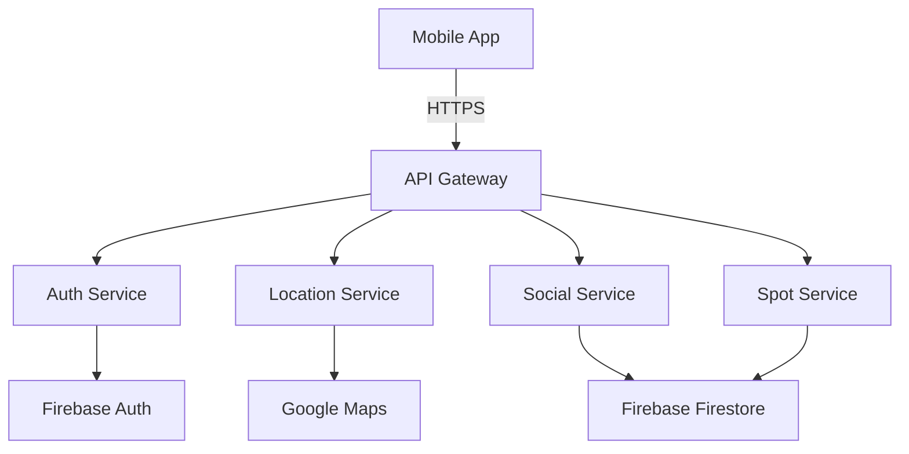
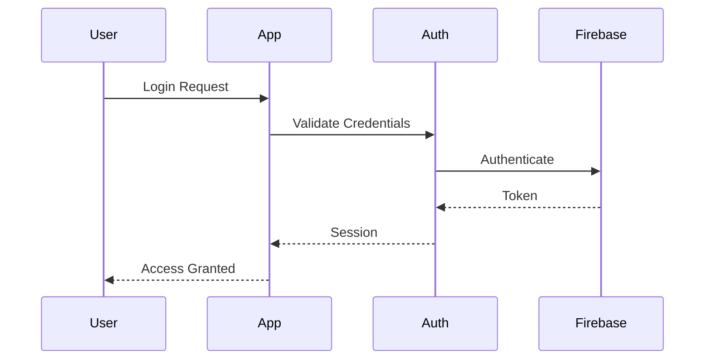
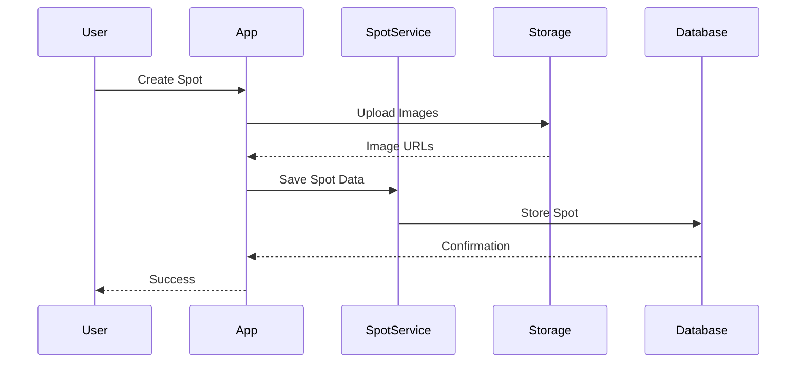

# FishPro Architecture Documentation

## System Overview

### High-Level Architecture


### Core Components

#### Mobile Application
- Flutter/Dart framework
- BLoC pattern for state management
- Clean Architecture
- Offline-first design

#### Backend Services
- Firebase Authentication
- Cloud Firestore
- Cloud Storage
- Cloud Functions
- Google Maps Platform

## Component Details

### Feature Modules

#### Authentication Module
```dart
lib/features/auth/
├── data/
│   ├── repositories/
│   └── models/
├── domain/
│   ├── entities/
│   └── usecases/
└── presentation/
    ├── bloc/
    ├── pages/
    └── widgets/
```

#### Location Module
```dart
lib/features/location/
├── services/
│   ├── map_manager_service.dart
│   ├── map_style_service.dart
│   └── fishing_spot_service.dart
├── models/
│   ├── map_models.dart
│   └── fishing_spot_models.dart
└── presentation/
    ├── bloc/
    ├── pages/
    └── widgets/
```

#### Social Module
```dart
lib/features/social/
├── groups/
│   ├── services/
│   └── models/
├── recommendations/
│   ├── services/
│   └── models/
└── presentation/
    ├── bloc/
    ├── pages/
    └── widgets/
```

## Data Flow

### Authentication Flow


### Spot Creation Flow


## Technical Decisions

### State Management
- BLoC pattern for complex state
- Provider for simple state
- Cached repository pattern
- Offline-first approach

### Data Storage
1. Local Storage
   - Secure storage for sensitive data
   - SQLite for offline data
   - Shared preferences for settings
   - File system for cached images

2. Cloud Storage
   - Firestore for real-time data
   - Cloud Storage for media
   - Firebase for authentication
   - Cloud Functions for backend logic

### Performance Optimization
- Lazy loading
- Image caching
- Offline support
- Background sync
- Memory management

## Dependencies

### Core Dependencies
```yaml
dependencies:
  flutter_bloc: ^8.0.0
  firebase_core: ^2.0.0
  cloud_firestore: ^4.0.0
  google_maps_flutter: ^2.0.0
  geolocator: ^9.0.0
  shared_preferences: ^2.0.0
  http: ^0.13.0
```

### Development Dependencies
```yaml
dev_dependencies:
  flutter_test: ^2.0.0
  bloc_test: ^9.0.0
  mockito: ^5.0.0
  build_runner: ^2.0.0
```

## Integration Points

### External Services
1. Google Maps Platform
   - Maps SDK
   - Places API
   - Directions API
   - Geocoding API

2. Firebase Services
   - Authentication
   - Firestore
   - Storage
   - Functions
   - Analytics

3. Third-Party Services
   - Weather API
   - Social sharing
   - Push notifications
   - Analytics

## Scalability Considerations

### Performance Scaling
- Lazy loading implementation
- Pagination strategies
- Caching mechanisms
- Resource optimization

### Data Scaling
- Database indexing
- Query optimization
- Data partitioning
- Cache strategies

### Infrastructure Scaling
- Load balancing
- CDN integration
- Regional deployment
- Resource allocation

## Future Considerations

### Planned Improvements
1. Technical Improvements
   - Enhanced offline capabilities
   - Performance optimization
   - Battery usage optimization
   - Memory management

2. Feature Additions
   - Advanced search
   - Social features
   - AI recommendations
   - Real-time updates

3. Infrastructure Updates
   - Multi-region support
   - Enhanced security
   - Monitoring tools
   - Backup solutions
