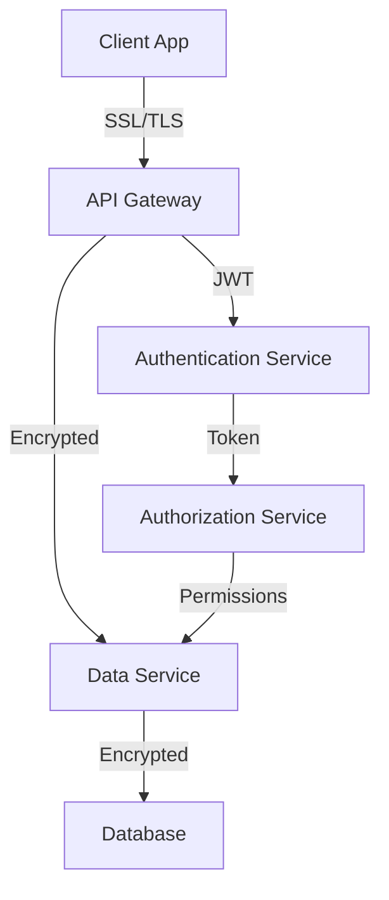

# FishPro Security Documentation

## Security Features

### Authentication
- Multi-Factor Authentication (MFA)
- Biometric authentication support
- Session management
- Token-based authentication
- Secure password recovery

### Data Protection
- End-to-end encryption
- Secure data storage
- Data backup encryption
- Secure file transfer
- Privacy controls

### Access Control
- Role-based access control
- Permission management
- Group-level security
- API access control
- Resource isolation

## Security Best Practices

### Code Security
```dart
// Secure data storage example
class SecureStorage {
  static final _storage = FlutterSecureStorage();
  
  static Future<void> saveSecureData(String key, String value) async {
    await _storage.write(
      key: key,
      value: value,
      aOptions: AndroidOptions(
        encryptedSharedPreferences: true,
      ),
    );
  }
}

// Secure API calls example
class ApiService {
  Future<Response> secureRequest(String endpoint) async {
    final token = await SecureStorage.getToken();
    return await http.get(
      Uri.parse(endpoint),
      headers: {
        'Authorization': 'Bearer $token',
        'X-API-Key': Config.apiKey,
      },
    );
  }
}
```

### Data Handling
1. User Data
   - Encryption at rest
   - Secure transmission
   - Data minimization
   - Regular purging

2. Location Data
   - Anonymization
   - Precision control
   - Access restrictions
   - Usage transparency

3. Media Files
   - Secure storage
   - Access control
   - Metadata stripping
   - Temporary file cleanup

## Privacy Considerations

### User Privacy
- Data collection consent
- Privacy settings control
- Data access requests
- Right to be forgotten
- Data portability

### Location Privacy
- Location sharing controls
- Geofencing privacy
- Location data retention
- Anonymous mode option

### Social Features
- Profile visibility controls
- Group privacy settings
- Content sharing controls
- Block and report features

## Compliance

### GDPR Compliance
- User consent management
- Data processing records
- Privacy policy
- Data protection officer
- Breach notification

### Data Protection
1. Personal Data
   - Collection purpose
   - Storage duration
   - Processing methods
   - Access controls

2. Sensitive Data
   - Special handling
   - Enhanced security
   - Limited access
   - Audit trails

### Security Audits
- Regular security reviews
- Penetration testing
- Vulnerability scanning
- Code security analysis

## Incident Response

### Security Incidents
1. Detection
   - Monitoring systems
   - Alert mechanisms
   - User reports
   - Automated scanning

2. Response
   - Incident classification
   - Response team
   - Containment measures
   - User notification

3. Recovery
   - Service restoration
   - Data recovery
   - Security patch
   - Post-incident review

### Reporting
- Incident documentation
- User communication
- Authority notification
- Compliance reporting

## Security Architecture

### System Security


### Security Layers
1. Network Security
   - SSL/TLS encryption
   - API gateway
   - Firewall rules
   - DDoS protection

2. Application Security
   - Input validation
   - Output encoding
   - Session management
   - Error handling

3. Data Security
   - Encryption
   - Access control
   - Backup security
   - Data integrity

## Security Guidelines

### Developer Guidelines
- Secure coding practices
- Dependency management
- Security testing
- Code review process

### User Guidelines
- Password requirements
- MFA setup guide
- Privacy settings
- Security features

### Operational Guidelines
- Access management
- Monitoring procedures
- Incident response
- Update management
